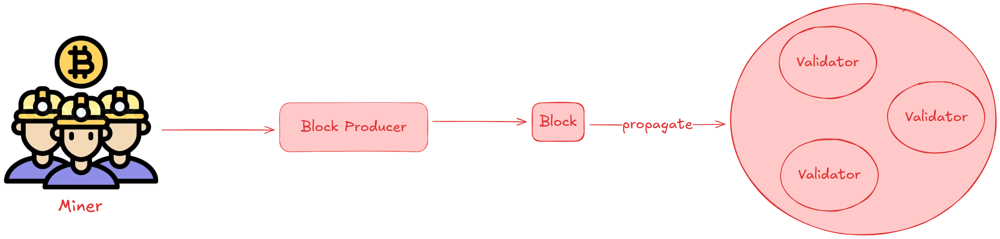
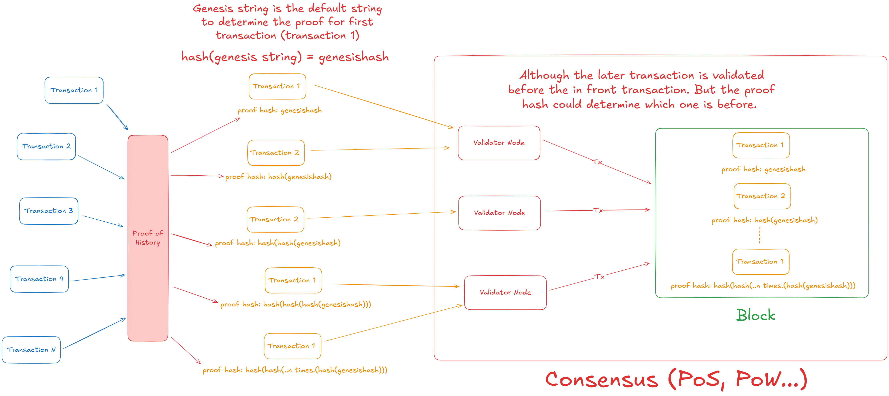

# Substrate Proof of History

## Motivation

Layer 1 blockchains serve as the backbone of the crypto space, but one of their common drawbacks is limited transaction speed. Among them, `Solana` stands out as a Layer 1 blockchain offering key advantages, including low transaction fees and fast processing times. While it employs the `Proof of Stake (PoS)` consensus mechanism—also used by `Ethereum` and other blockchains - `Solana` achieves its remarkable speed through an innovative feature.

This feature is the `Proof of History (PoH)` mechanism. It’s important to note that `PoH` is not a standalone consensus mechanism. Instead, `Solana` integrates `PoH` as an additional layer to enhance its `Proof of Stake` consensus, significantly boosting transaction throughput and efficiency.

## What is this course?

This substrate course will help you to learn how to build the first blockchain using [Polkadot-SDK](https://github.com/paritytech/polkadot-sdk) which is the Open source providing all the components needed to start building on the [Polkadot](https://polkadot.com/) Network and explore how the Proof of History mechanism works.

Polkadot-SDK is merged from the 3 core repositories consists of Substrate, Cumulus and Polkadot. Polkadot-SDK is built by [Rust](https://www.rust-lang.org/), a powerful programming language. The document of this language is fully and pretty easy to read and explore so we won't discuss the details of it during this course.

We are willing if you read/research/watch about Polkadot-SDK and Proof of History. If not, the following things maybe help you:

- Polkadot-SDK:

  - [Polkadot SDK Tutorials](https://docs.polkadot.com/tutorials/polkadot-sdk/)

  - [Polkadot SDK Repository](https://github.com/paritytech/polkadot-sdk)

  - [Open Polkadot Bootcamp 2025 playlist - Polkadot SDK - OpenGuild](https://youtube.com/playlist?list=PLnhzaKpksqOKiqu9DDjGnmZWB0hYTaOUC&si=B1SRZFvehi8YbHI_)

- Proof of History:

  - [Solana Whitepaper](https://solana.com/solana-whitepaper.pdf)

  - [Proof of History Explanation - Cédric Walter](https://github.com/cedricwalter/blockchain-consensus/blob/master/chain-based-proof-of-capacity-space/proof-of-history.md)

## What is Proof of History?

Proof of History is a sequence of computation that can provide a way to cryptographically verify passage of time between two events. Simplify, it is a proof that time has passed between two events/transactions/statements. This work can only be computed/run on `one core` and while being verified on many cores using parallelization.

Normally, Proof of Work used in `Bitcoin` Network will take times to propagate new blocks to each `validator node` and Validator Node needs to validate the block and converge on a order. If we have a lot of blocks in the progress, the problem starts to appear. Then, Bitcoin solved by making larger hash values for miners. This solution causes the high mining time for BTC, approximately `10 minutes`

Proof of History is a clock creating a time ordering to allow validator nodes to determine the order of incoming blocks. Because of this, we don't need to wait for validators and continuing processing transactions.

The proof hash is computed by the proof hash of the previous transactions and the proof hash of first transaction is took from `Genesis string`.

In addition, some external events occurs during the transaction progress and the proof hash will be computed by the alternative way.

## Tutorial Steps

### Business logic

### Prerequisites

### Step 0: Setup your local environment
